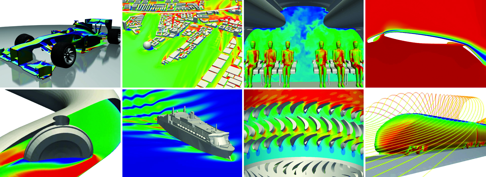

## Engys: Intro

A unique collaboration between academia and industry has created a novel simulation-as-a-service model 
offering cost effective, pay-per-use access to advanced CFD modelling on HPC cloud.    
 
Independent CFD consultancy ENGYS has developed a general-purpose CFD software solution for engineering analysis 
and design optimisation. Called HELYX, it is based on an advanced open source simulation engine that uses OpenFOAM 
technology. A collaboration with EPCC at the University of Edinburgh has created a simulation-as-a-service business 
model offering cost effective, pay-per-use access to advanced CFD modelling based on an implementation of HELYX on EPCC’s 
Cirrus HPC cloud. A purpose-built, easy-to-use interface provide users with seamless migration from local desktop to 
operation on the Cirrus HPC cloud, providing significant advantages of scale.  

## Engys: Body 

* [Online Cirrus User Documentation](http://cirrus.readthedocs.io)
* [Engys](engys.md)

## Contact Us

If you are interesated in creating a case study highlighting your work on Cirrus then please do not hesitate to
[contact the support team](../support/).
